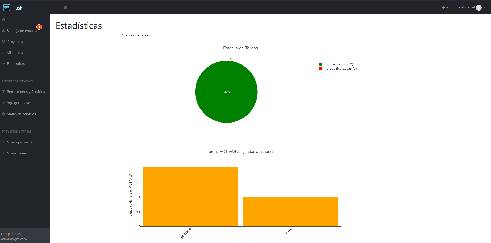
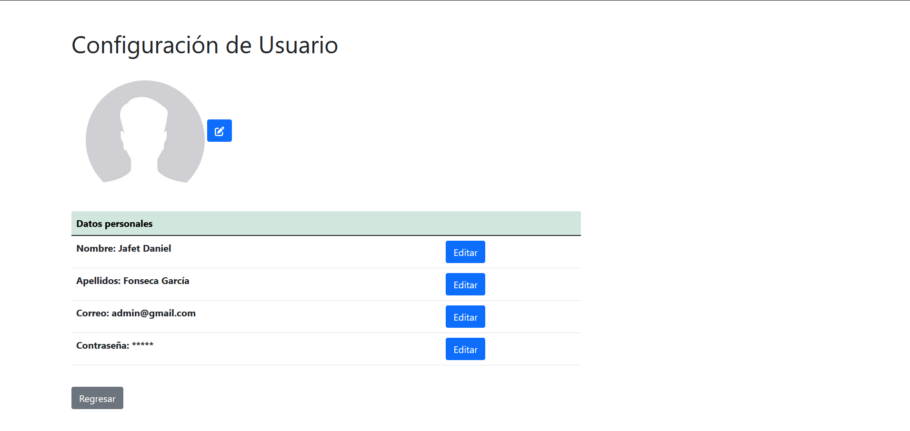

# sistema-web-ERP-GMTask
Proyecto desarrollado para la empresa General Motors de México S. de R.L. de C.V.

Nombre:
“sistema web ERP para el control de compras y servicios en el área de mantenimiento”

Tecnologías:
<ul>
  <li>Sistema creado con el lenguaje PHP</li>
  <li>HTML, CSS, JS, Bootstrap, JQuery, Ajax</li>
  <li>Base de datos MySQL</li>
</ul>

Descripción:
Este sistema tiene la funcionalidad de registrar “servicios” de la empresa por medio de una base de datos. Tiene la función de poder, modificar, eliminar y exportar dicha información de los servicios en formato Excel, pdf, etc. Dentro de cada registro se puede adjuntar archivos respecto a dicho servicio, además de una sección de comentarios donde los empleados de la empresa podran interactuar comentando algun cambio o dato relevante del respectivo servicio.
Tmabien, la segunda funcionalidad del sitio es donde cuenta con una sección de gestión de tareas y proyectos, esta sirve como un software un tanto parecido a ASANA o TEAMS, donde se pueden crear proyectos, agregar miembros a dicho proyecto y dentro de los proyectos poder crear tareas. En las tareas se pueden adjuntar archivos o imágenes, comentarios, entre otras características. Esta sección es básicamente para poder gestionar y monitorear las actividades o tareas laborales de los trabajadores del área.

Imágenes ilustrativas:

